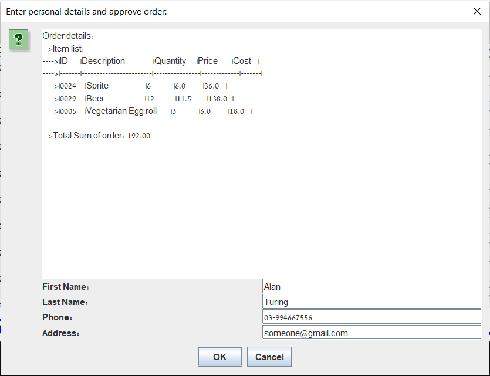
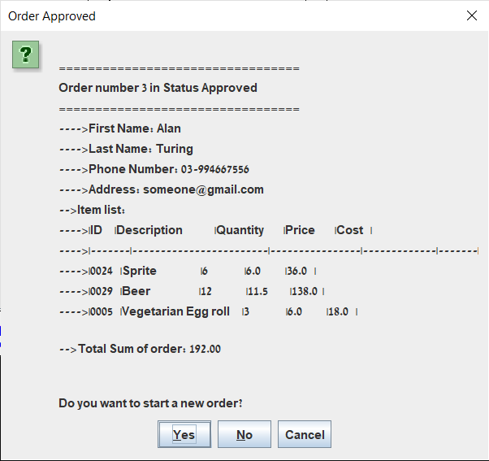

# Java-Client-Server-Restaurant-Application

## Description 
Java Swing Destop Application for Setting Dish Orders - Coke From Clients To a Restaurant Server Via a Graphical User Interface Menu Over a TCP Connection.

## Usage 
Inorder to run application, run the server first ([runServer.bat](runServer.bat)), 
so it gets ready to accept connections, and then the client ([runClient.bat](runClient.bat)). 
Remark: On default both run on localhost

## UI Screenshots 
### Menu 

### Input Contact Details Form 

### Order Approval 

## Terminal Screenshots 
### Server Terminal:

### Client Terminal:

